 

 

---

# 👨‍💻 About Me

Hi! I'm **Subhradip Bhunia**, a passionate **BCA student, Web Developer, Python Developer and MERN Stack Developer** who enjoys building real-world applications and modern websites.

I love transforming ideas into practical projects and continuously improving my programming, development and problem-solving skills.

- 🎓 BCA Student
- 💻 Web Developer
- 🐍 Python Developer
- 🌐 MERN Stack Developer
- ☕ Java Developer
- 🤖 AI & Machine Learning Enthusiast
- 🔐 Interested in Software & Technology
- 🚀 Building Real-World Projects
- 📚 Continuous Learner
- 💡 Problem Solver

---

# 🛠️ Skills & Technologies

## 💻 Programming Languages

 

## 🌐 Web Development

 

## 🗄️ Database

 

## 🔧 Tools & Platforms

---

# 🎓 Academic Journey

### 🎓 Bachelor of Computer Applications

**Adamas University, Kolkata**

 

### 📊 BCA Semester Performance

| 📚 Semester | 📊 SGPA | 📌 Status |
|:-----------:|:-------:|:---------:|
| 1️⃣ Semester 1 | **5.45** | ✅ Completed |
| 2️⃣ Semester 2 | **6.23** | ✅ Completed |
| 3️⃣ Semester 3 | **6.81** | ✅ Completed |
| 4️⃣ Semester 4 | **7.79** | ✅ Completed |
| 5️⃣ Semester 5 | **8.32** | ✅ Completed |
| 6️⃣ Semester 6 | **8.27** | ✅ Completed |
| 7️⃣ Semester 7 | **—** | 🔄 Upcoming |
| 8️⃣ Semester 8 | **—** | 🎯 Upcoming |

 

| 📈 Academic Metric | Result |
|:-------------------|:------:|
| 🎓 Program | **BCA** |
| 📚 Total Semesters | **8** |
| ✅ Completed | **6** |
| 🔄 Remaining | **2** |
| 📊 Average SGPA | **6.98** |
| 🏆 Highest SGPA | **8.32** |
| 🚀 Latest SGPA | **8.27** |

---

# 🏫 School Academic Performance

## 📘 Madhyamik Examination — 2021

| Subject | Marks |
|:--------|------:|
| First Language | **85** |
| Second Language | **85** |
| Mathematics | **84** |
| Physical Science | **85** |
| Life Science | **85** |
| History | **90** |
| Geography | **90** |
| Optional Elective | **86** |
| **Grand Total** | **604** |

### 🏆 Percentage: **86.29%**

### Overall Grade: **A+**

---

## 📕 Higher Secondary Examination — 2023

| Subject | Marks |
|:--------|------:|
| Bengali | **60** |
| English | **82** |
| Biology | **52** |
| Geography | **71** |
| Nutrition | **60** |
| Computer Application | **68** |
| **Grand Total** | **341** |

### 🏆 Percentage: **68.20%**

### Overall Grade: **B+**

---

# 📚 Complete Academic Summary

| 🎓 Qualification | 📅 Year | 📊 Marks / SGPA | 📈 Percentage |
|:-----------------|:-------:|:---------------:|:-------------:|
| Madhyamik | 2021 | **604 / 700** | **86.29%** |
| Higher Secondary | 2023 | **341 / 500** | **68.20%** |
| BCA Semester 1 | — | **5.45 SGPA** | — |
| BCA Semester 2 | — | **6.23 SGPA** | — |
| BCA Semester 3 | — | **6.81 SGPA** | — |
| BCA Semester 4 | — | **7.79 SGPA** | — |
| BCA Semester 5 | — | **8.32 SGPA** | — |
| BCA Semester 6 | — | **8.27 SGPA** | — |

 

### 📈 Academic Growth

**5.45 SGPA → 8.27 SGPA**

🚀 **Consistent Improvement Throughout BCA**

---

# 🚀 Featured Projects

## 😷 Mask Detection System

An AI-based computer vision project designed to detect whether a person is wearing a face mask.

### 🧰 Technologies

`Python` `OpenCV` `Machine Learning`

### ✨ Features

- 😷 Face Mask Detection
- 📷 Real-Time Camera Detection
- 🤖 AI-Based Image Processing
- ⚡ Fast Detection
- 🖼️ Image Processing

---

## 📸 Photography Website

A modern and responsive photography portfolio website designed to showcase photography, creative work and visual stories.

### 🧰 Technologies

`HTML` `CSS` `JavaScript`

### ✨ Features

- 📷 Photography Gallery
- 🖼️ Image Showcase
- 🎨 Modern UI
- 📱 Responsive Design
- 🌐 Portfolio Website
- 📱 Mobile Friendly

---

## 🗳️ Online Voting System

A secure online voting platform developed using the MERN Stack.

### 🧰 Technologies

`React` `Vite` `Node.js` `Express.js` `MongoDB`

### ✨ Features

- 👤 User Registration & Login
- 🔐 Secure Authentication
- 🗳️ Online Voting
- 👨‍💼 Admin Dashboard
- 📊 Election Management
- 📈 Result Display
- 🔒 One Vote Per User

---

## 🌾 Smart Farmer Decision Support System

A smart agriculture platform designed to help farmers make better decisions using technology, data and AI.

### 🧰 Technologies

`HTML` `CSS` `JavaScript` `Python` `Node.js` `MongoDB`

### ✨ Features

- 🌱 Crop Recommendation
- 🌦️ Weather Suggestions
- 🦠 Disease Detection
- 📊 Crop Yield Prediction
- 💰 Market Price Prediction
- 💧 Smart Irrigation
- 🤖 AI-Based Suggestions

---

# 📊 GitHub Statistics 
   

---

# 🔥 GitHub Streak

---

# 🏆 GitHub Achievements 
  

---
# 🐍 My Contributions 
 <picture> <source media="(prefers-color-scheme: dark)" srcset="https://raw.githubusercontent.com/subhrabhunia/subhrabhunia/output/github-contribution-grid-snake-dark.svg"> <source media="(prefers-color-scheme: light)" srcset="https://raw.githubusercontent.com/subhrabhunia/subhrabhunia/output/github-contribution-grid-snake.svg">  </picture> 

---

# 📈 Contribution Activity

---

# 🌱 Currently Learning

 

`React.js`
•
`Node.js`
•
`Express.js`
•
`MongoDB`
•
`Python`
•
`Git`

---

# 🎯 2026 Goals

| Goal | Status |
|:-----|:------:|
| 🚀 Build Real-World Projects | 🔄 In Progress |
| 💻 Improve Full Stack Development | 🔄 Learning |
| 🧠 Master Data Structures & Algorithms | 🔄 Learning |
| 🤖 Explore AI & Machine Learning | 🔄 Learning |
| 🌐 Contribute to Open Source | 🎯 Planned |
| 💼 Prepare for Software Development | 🎯 Planned |

---

# 📜 Certifications

| 🏅 Certification | 📌 Details |
|:-----------------|:-----------|
| 🤖 **Gen AI Tools — NASSCOM / IT-ITeS SSC** | 🥇 Gold • **98% Score** |
| 🤖 **Gen AI Tools — IT-ITeS SSC NASSCOM** | Certificate of Participation |
| 💻 **Full-stack Web Developers and Back-end Developers — Coursera** | 12 Learning Hours |
| 🚀 **30 Days Summer Internship — IgniteU** | Jun 2025 – Jul 2025 |

---

# 📄 Resume

 

<a href="./resume.pdf">

**📥 Click Here to View / Download My Resume**

</a>

---

# 🌐 Connect With Me

---

# 👀 Profile Visitors

---

# 💭 Developer Quote

### "Code. Learn. Build. Repeat. 🚀"

 

---

### ⭐ Thanks for visiting my GitHub Profile!

### 💙 Keep Coding • Keep Learning • Keep Building

**Made with ❤️ by Subhradip Bhunia**

 

